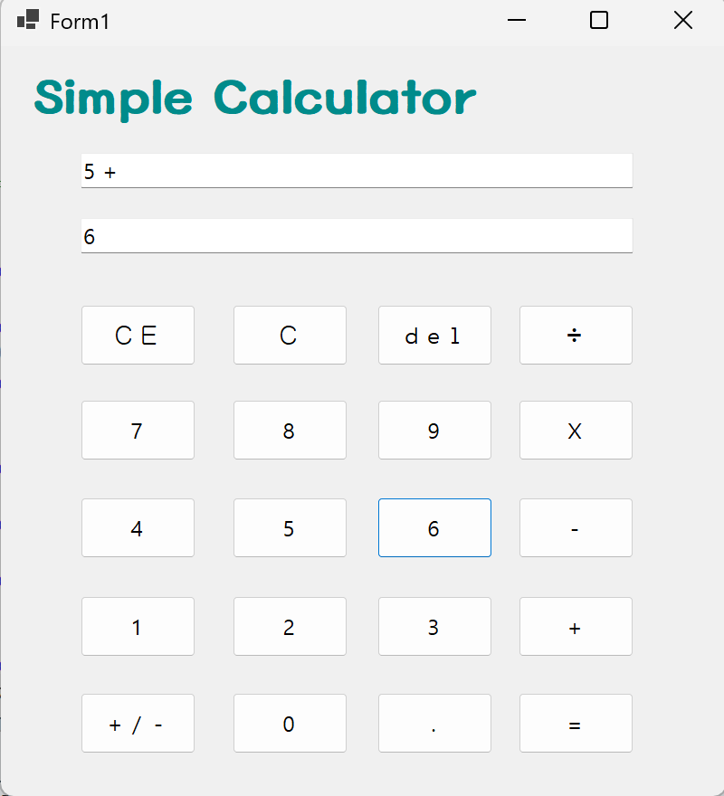
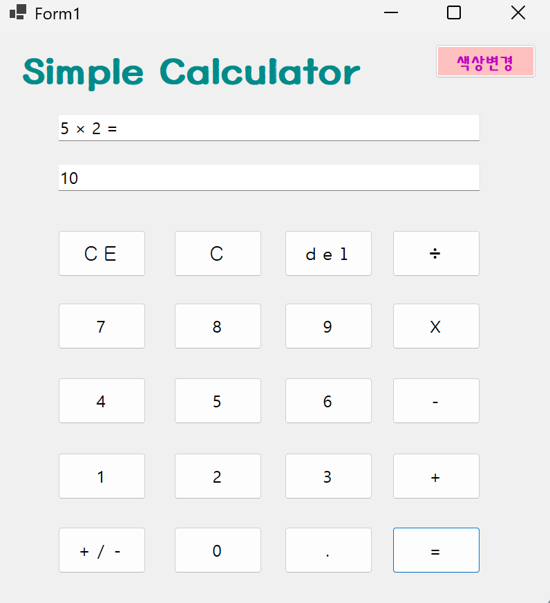

# 4주차 과제: (C# 코딩) Simple Calculator (심플 사칙연산기)
- 이름: 하다현 (24018097)

## 개요
- C# 프로그래밍 학습 및 Windows Forms 기반으로 계산기 프로그램 구현
- 1줄 소개: 사용자로부터 키보드와 버튼 입력을 받아 처리하는 심플 사칙연산기
- 사용한 플랫폼: C#, .NET Windows Forms, Visual Studio, GitHub
- 사용한 컨트롤: Label, TextBox, Button
- 사용한 기술과 구현한 기능:
  - Visual Studio를 이용하여 UI 디자인
  - string 클래스를 이용하여 사용자 입력 데이터 처리
  - ListBox 컬렉션과 TextBox를 활용한 데이터 관리
  - 이벤트 기반 프로그래밍 (Click, KeyDown) 구현
  - 사용자 입력 검증 및 예외 처리 기능 구현
  - Trim()을 이용하여 문자열 정제 기능 구현
  - Random 클래스와 Color 구조체를 이용한 랜덤 색상 변경 기능 구현

---

## 실행 화면 (과제1)

- 과제 내용
  - TextBox 2개(입력창, 결과창), Label, Button(전송)을 적절히 배치
    cf) Label → lbTitle  
        TextBox 2개 → txtExpression(입력창), txtResult(결과창)  
        숫자 버튼 (0~9) → btn0~btn9  
        연산 버튼 → btnPlus(+), btnSub(-), btnMul(x), btnDiv(÷)  
        기능 버튼 → btnEquals(=), btnDot(.), btnSign(±)  
        초기화/삭제 → btnClear(C), btnClearEntry(CE), btnDelete(Del)

- 구현 내용과 기능 설명
  - 사용자가 입력창(txtResult)에 숫자나 연산자를 입력하고 버튼 클릭 시 입력값이 화면에 표시됨
  - ListBox 대신 TextBox를 활용하여 연산식과 결과를 표시
  - 입력 완료 후 TextBox.Clear()를 이용해 다음 입력 준비
  - 사용한 기술:
    - Visual Studio Form Designer를 이용한 컨트롤 배치
    - Click 이벤트를 이용한 버튼 입력 처리
    - TextBox.Clear()를 이용한 입력창 초기화

---

## 실행 화면 (과제2)

- 과제 내용
  - 사칙연산 기능 완성
    - 덧셈(+), 뺄셈(-), 곱셈(x), 나눗셈(÷)
    - 나눗셈 시 0으로 나누기 방지
  - 각 연산 버튼 클릭 시 연산자만 변경, 기존 로직 그대로 적용
  - = 버튼 클릭 시 계산 수행, 결과 표시
  - txtExpression 위쪽에는 `2 × 5 =` 형식으로 식 표시, txtResult 아래쪽에는 계산 결과 표시

- 구현 내용과 기능 설명
  - btnPlus, btnSub, btnMul, btnDiv 클릭 시 num1, op 저장 후 txtResult 초기화
  - btnEnter 클릭 시 num2 가져와 계산 수행
  - 계산 결과 txtResult에 표시
  - 위쪽 txtExpression에는 `num1 연산자 num2 =` 형식으로 표시
  - 화면 표시용 연산자: `*` → `×`, `/` → `÷`
  - 나눗셈 시 num2가 0이면 MessageBox.Show("0으로 나눌 수 없습니다.") 출력
  - 사용한 기술:
    - int.Parse() / double.Parse()를 이용한 숫자 변환
    - if / switch문을 이용한 연산 처리
    - MessageBox를 이용한 예외 처리

---

## 실행 화면 (과제3)
.png)

- 과제 내용
  - C, CE, Del 버튼 기능 구현
    - C 버튼 → 현재 모든 내용 삭제, 초기 상태로 되돌림
    - CE 버튼 → 마지막 입력한 피연산자 값 삭제
    - Del 버튼 → 마지막 입력 글자 하나 삭제

- 구현 내용과 기능 설명
  - C 버튼 클릭 시 num1, num2, op 초기화, txtExpression, txtResult 초기화
  - CE 버튼 클릭 시 txtResult만 초기화
  - Del 버튼 클릭 시 txtResult 마지막 글자 삭제 (txtResult.Length > 0 조건 체크)
  - Del/CE 클릭 시 값이 없으면 아무 동작하지 않도록 예외 처리
  - txtExpression은 연산 기호와 입력 값은 그대로 표시
  - 사용한 기술:
    - String.Remove()를 이용한 마지막 글자 삭제
    - if 조건문으로 입력값 존재 여부 확인
    - 이벤트 Click을 이용한 버튼 기능 구현

---

## 실행 화면 (과제4)
.png)

- 과제 내용
  - 사용자 편의 기능 추가
    - 랜덤 색상 변경 버튼 추가 → 클릭 시 폼과 TextBox 색상 변경

- 구현 내용과 기능 설명
  - btnRandomColor 클릭 시 폼과 TextBox 배경색 랜덤 변경
  - Visual Studio Random 클래스 사용, Color.FromArgb()로 RGB 랜덤 색상 적용
  - 위쪽 연산창(txtExpression)과 아래쪽 결과창(txtResult) 배경색이 랜덤으로 변경됨
  - 아직 다른 편의 기능(키보드 단축키, ± 버튼, 소수점 입력 등)은 구현하지 않음

- 사용한 기술과 구현한 기능
  - Random 클래스와 Color 구조체를 이용한 랜덤 색상 적용
  - txtExpression과 txtResult의 UI 업데이트

---

## +) 기능 설명

### 1단계 - 기본 UI 및 데이터 연동
1. Label로 "Simple Calculator" 제목 표시
2. TextBox 2개 및 숫자/연산/기능 버튼 배치
3. 버튼 클릭 시 txtResult에 숫자/연산자 입력
4. 입력 후 TextBox.Clear()로 입력창 초기화

### 2단계 - 사칙연산 기능 구현
1. 덧셈, 뺄셈, 곱셈, 나눗셈 수행
2. 나눗셈 0 방지 예외 처리
3. txtExpression과 txtResult 분리 표시
4. 연산자 화면 표시: * → ×, / → ÷

### 3단계 - C, CE, Del 기능
1. C → 전체 초기화
2. CE → 현재 입력값 삭제
3. Del → 마지막 글자 삭제
4. 예외 처리: 값 없을 때 버튼 클릭 방지

### 4단계 - 사용자 편의 기능
1. 랜덤 색상 버튼: RGB 랜덤 변경

---

## 구현 시 어려웠던 점
- 버튼 클릭 시 랜덤 색상을 적용하는 코드 이해가 어려웠지만, RGB 개념과 Color.FromArgb()를 공부하며 해결함
- KeyDown 이벤트를 통해 키보드 단축키를 버튼 클릭과 연결하는 로직 구현
- = 버튼 클릭 시 위쪽 연산창과 아래쪽 결과창을 동시에 업데이트하는 로직 설계
- txtResult 입력과 txtExpression 표시를 동시에 처리하는 로직을 설계하는데 고민